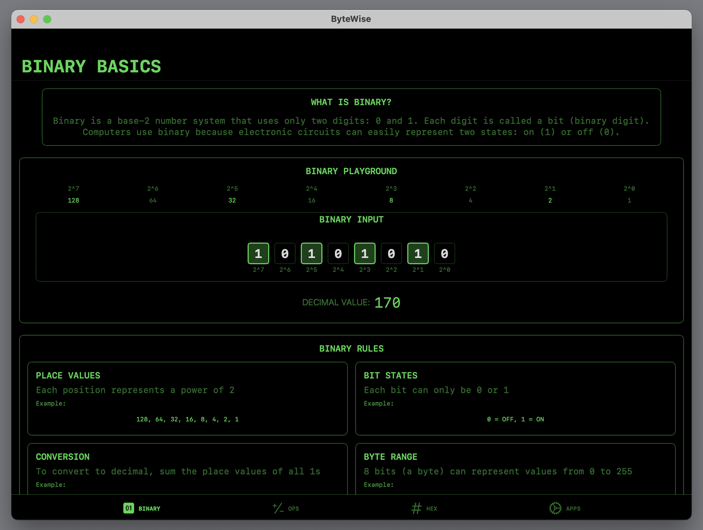
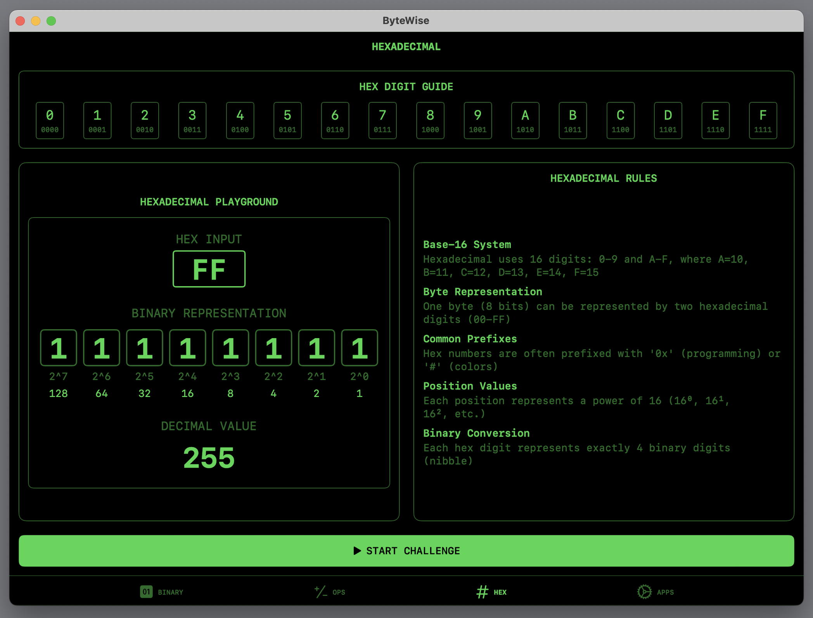

# ByteWise

ByteWise is an interactive iOS app that teaches binary, hexadecimal, and computer fundamentals through hands-on challenges and visual demonstrations. Created as part of the Swift Student Challenge 2025, ByteWise makes learning computer number systems engaging and accessible.

## Features

### Binary Basics
Learn and practice binary number conversions with an interactive bit toggle interface and timed challenges. Perfect for beginners starting their journey into computer science fundamentals.

### Binary Operations 
Master bitwise operations (AND, OR, XOR, NOT, SHIFT) through guided examples and practice exercises. Visualize how bits interact and understand the foundation of computer operations.

### Hexadecimal
Understand hexadecimal notation and practice converting between number systems with a helpful digit guide. Learn why hex is crucial in modern computing.

### Real-World Applications
Explore how binary is used in everyday computing:
- ASCII text encoding for character representation
- RGB color coding for digital graphics
- File sizes and storage calculations
- Unix file permissions and access control

### ASCII Text Converter
Convert between text characters and their binary/decimal ASCII values with an intuitive interface. Understand how computers store and process text.

## Technologies
- SwiftUI for modern, responsive UI
- Core Animation for smooth transitions
- Combine framework for reactive updates
- Core Data for progress tracking
- Swift Playgrounds integration

## Requirements
- iOS 16.0+
- iPad
- Swift Playgrounds 4.0+ for development

## Installation
1. Download the Swift Playgrounds project
2. Open in Swift Playgrounds on iPad or Mac
3. Run the project to start learning

## Swift Student Challenge
ByteWise was developed for the Swift Student Challenge 2025, focusing on creating an educational tool that makes computer science fundamentals more approachable through interactive learning.

## About
ByteWise was created to make learning binary and computer number systems more engaging and interactive through hands-on practice and real-world examples. The app caters to visual and interactive learners, providing a friendlier approach to computer basics that bridges the gap between theory and practical application.

## Future Plans
- Additional number systems (octal, base64)
- More interactive challenges and exercises
- Expanded real-world examples
- Community contribution features
- Cross-platform support

## Contact
For questions, feedback, or suggestions, please open an issue in this repository :)
